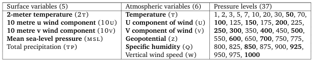
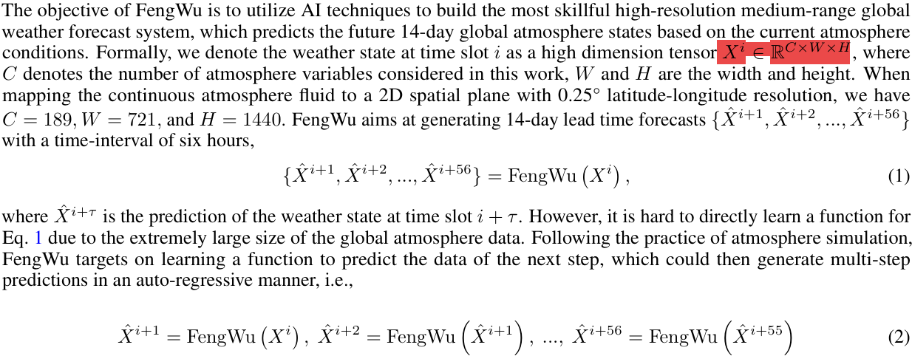
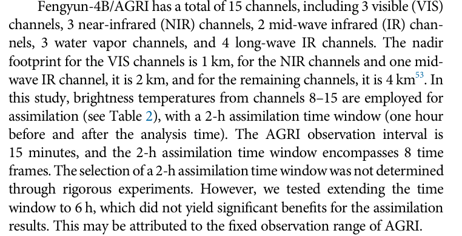

## Deep learning for twelve hour precipitation forecasts

**label**: radar precipitation estimates

**sample**:  radar, satellite, and weather state

(**to be supplement**)

## GraphCast: Learning skillful medium-range global weather forecasting

***C= 227 W=721 H=1440***

## FENGWU: PUSHING THE SKILLFUL GLOBAL MEDIUM-RANGE WEATHER FORECAST BEYOND 10 DAYS LEAD

***C= 189 W=721 H=1440***

 In this study, FengWu simulates 5 atmospheric variables (each with 37 pressure levels) and four surface variables, a total of 189 predictands.

Specifically, the atmospheric variables are geopotential (z), relative humidity (r), zonal component of wind (u), meridional component of wind (v), and air temperature (t)

And the four surface variables are 2-meter temperature (t2m), 10-meter u wind component (u10), 10-meter v wind component (v10), and mean sea level pressure (msl).

 For consistency, we follow the validation strategies demonstrated by GraphCast, i.e., the data from 1979-2015 is used for training, 2016-2017 for validation, and 2018 for testing. In addition, we also leverage the 6-hourly sampled data (T00, T06, T12, T18) instead of the hourly ERA5 dataset for training.

0.25×0.25

## FuXi: a cascade machine learning forecasting system for 15-day global weather forecast

***C= 70 W=721 H=1440***

- **introduction**: A subset of ECMWF ERA5 reanalysis dataset covers 39 years and includes 70 variables, which comprise 5 upper-air atmospheric variables (geopotential, temperature, u component of wind, v component of wind , and relative humidity) at 13 pressure levels(50, 100, 150, 200, 250, 300, 400, 500, 600, 700, 850, 925, and 1000hPa) and 5 surface variables(T2M, 10-meter u wind component , 10-meter v wind component , MSL, and Total Precipitation).  It has a spatial resolution of 0.25° (721 × 1440 latitude-longitude grid points) and a temporal resolution of 6 hours.
- **spliting method**:  Following previous studies in splitting the data into training, validation, and testing set12,17, the training set consists of 54020 (54020 = 365×4×37, similarly, 2920 = 365×4×2, and 1460 = 365×4) samples spanning from 1979 to 2015. The validation set contains 2920 samples corresponding to the years 2016 and 2017, while out-of-sample testing is performed using 1460 samples from 2018.
- **input dimensions**: 2×70×721×1440, where 2,70,721, and 1440 represent the two preceding time steps (t−1 and t), the total number of input variables, latitude (H) and longitude (W) grid points, respectively.

## FuXi-DA: a generalized deep learning data assimilation framework for assimilating satellite observations

***sample C= 70+120（8×15） W=721 H=1440***

***label C= 70 W=721 H=1440***

**label**: ERA5 reanalysis data includes variables same as 2023 FUXI. (70channels)

**background**:  6-h forecast fields generated by the DL-based weather forecasting model FuXi. (70channels)

**observation data**: Fengyun-4B satellite.

## （FuXi Weather）A data-to-forecast machine learning system for global weather

## CONTINUOUS ENSEMBLE WEATHER FORECASTING WITH DIFFUSION MODELS

***C= 5 W=32 H=64***

We use the downsampled ERA5 reanalysis dataset (Hersbach et al., 2020) at 5.625◦resolution and 1-hour increments provided by **WeatherBench** (Rasp et al., 2020).

The models are trained to forecast 5 variables from the ERA5 dataset: geopotential at 500hPa (z500), temper ature at 850hPa (t850), ground temperature (t2m) and the ground wind components (u10, v10).

All models are trained on the period 1979–2015, validated on 2016–2017 and tested on 2018.

## CODICAST: CONDITIONAL DIFFUSION MODEL FOR GLOBAL WEATHER PREDICTION WITH UNCERTAINTY QUANTIFICATION

***C= 5 W=32 H=64***

Dataset. ERA5 (Hersbach et al., 2020) is a publicly available atmospheric reanalysis dataset pro vided by the European Centre for Medium-Range Weather Forecasts (ECMWF). Following the existing work (Verma et al., 2024), we use the preprocessed 5.625◦ resolution (32 × 64) and 6-hour increment ERA5 dataset from **WeatherBench** (Rasp et al., 2020). We downloaded 5 variables for the globe: geopotential at 500 hPa pressure level (Z500), atmospheric temperature at 850 hPa pressure level (T850), ground temperature (T2m), 10 meter U wind component (U10) and 10 meter V wind component (V10). More details can be found in Table 3 in Appendix A.

Baselines. We comprise the following baselines: ClimODE (Verma et al., 2024): a spatiotemporal continuous-time model that incorporates the physic knowledge of atmospheric advection over time; ClimaX (Nguyen et al., 2023): a state-of-the-art vision Transformer-based method trained on the same dataset (without pre-training that is used in the original paper); FourCastNet (Pathak et al., 2022): a global data-driven weather model using adaptive Fourier neural operators; Neural ODE (Chen et al., 2018): an ODE network that learns the time derivatives as neural networks by solving an ordinary differential equation; Integrated Forecasting System IFS (Rasp et al., 2020): a global numerical weather prediction (NWP) system, integrating multiple advanced physics-based models to deal with more meteorological variables across multiple altitudes. Our study focuses solely on a subset of these variables due to the limited computational resources, with IFS serving as the gold standard. For a fair comparison, all ML models use the same data set described in Section 4.1.

## LaDCast: A Latent Diffusion Model for Medium-Range Ensemble Weather Forecasting

